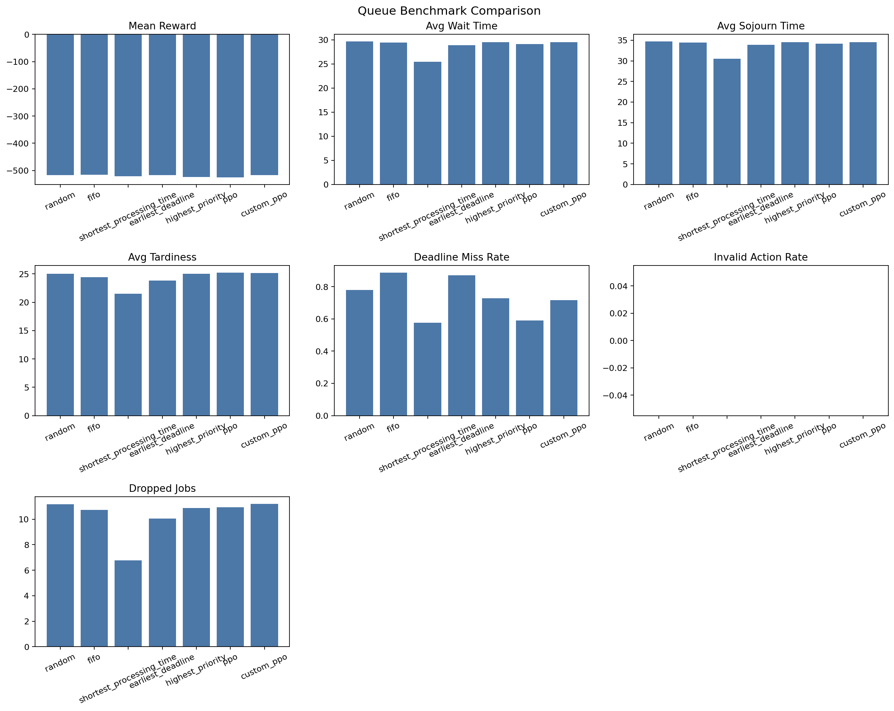

## RL Queue Handler

This project explores reinforcement learning for a single-server queueing problem
with stochastic arrivals, deadlines, priorities, and finite queue capacity. The
agent observes the current queue snapshot and chooses which waiting job to serve
next.

The repo benchmarks classical dispatching heuristics against two learned agents:

- Stable-Baselines3 `MaskablePPO`
- a custom PyTorch PPO implementation

The goal of the project is not only to train an RL agent, but also to study
how environment design, action masking, reward shaping, and baseline selection
affect learned behavior.

## Environment

The custom Gymnasium environment models a non-preemptive, single-server queue.

- Jobs arrive over simulated time rather than all existing at reset.
- Each job has `processing_time`, `priority`, `deadline`, and `arrival_time`.
- The queue has finite capacity, so late arrivals can be dropped if the system
  is congested.
- The action space is discrete: choose one currently visible queue slot to
  serve.
- Because only some queue slots are valid at any moment, learned agents use
  action masking.

Observation format:

- `current_time`
- `queue_length`
- zero-padded queue snapshot flattened into a fixed-size vector

This makes the environment compatible with standard MLP-based PPO policies.

## Setup

Install dependencies with `uv`:

```bash
uv sync
```

Run scripts with:

```bash
uv run python path/to/script.py
```

## Project Layout

- `envs/queue_env.py`: single-server queueing environment
- `baselines/heuristics.py`: FIFO, SPT, EDF, priority, and random baselines
- `baselines/train_ppo.py`: Stable-Baselines3 `MaskablePPO` trainer
- `baselines/ppo_agent.py`: custom PyTorch PPO implementation
- `baselines/eval_all.py`: combined benchmark runner and plot generation
- `remote_train/collab.ipynb`: notebook for local smoke tests, training, and evaluation
- `remote_train/modal.py`: optional Modal remote-training entrypoint

## Local Training

Train the SB3 PPO baseline:

```bash
uv run python baselines/train_ppo.py
```

Train the custom PPO agent:

```bash
uv run python baselines/ppo_agent.py
```

## Benchmarking

Benchmark heuristics and evaluate any saved PPO models:

```bash
uv run python baselines/eval_all.py
```

The benchmark writes:

- `results/benchmark_results.json`
- `results/benchmark_results.png`

Reported metrics include reward, average wait time, average sojourn time,
average tardiness, deadline-miss rate, invalid-action rate, dropped jobs, and
success rate.

Current benchmark snapshot:



## Baselines

The main handcrafted baselines are:

- random
- FIFO
- shortest processing time (SPT)
- earliest deadline first (EDF)
- highest priority first

These are intentionally strong queueing baselines, not just trivial controls.
In particular, SPT is often very competitive in a single-server queue because
serving short jobs first clears congestion quickly and tends to reduce waiting,
sojourn time, tardiness, and drops.

## Key Findings

One of the most useful outcomes of the project is that RL does not
automatically outperform classical scheduling heuristics in this environment.

In the current setup:

- SPT is a very strong baseline
- action masking is necessary for learned agents because the set of valid queue
  actions changes over time
- reward and evaluation metrics do not perfectly align

That last point matters a lot. The environment reward is based on episode-level
totals such as completion bonuses, priority bonuses, wait penalties, tardiness
penalties, and drop penalties. Some benchmark metrics, however, are reported as
per-completed-job averages. Because of that, a learned policy can sometimes get
better reward while still looking worse on average wait time or average
tardiness.

This makes the project a useful case study in:

- custom RL environment design
- heuristic vs RL benchmarking
- reward shaping
- action masking for dynamic discrete action spaces
- interpreting RL results beyond just reward curves

## Notebook Flow

Open [remote_train/collab.ipynb](/home/dylan/projects/rlQueueHandler/remote_train/collab.ipynb) and run:

1. optional heuristic smoke test
2. SB3 PPO training
3. optional custom PPO training
4. combined benchmark evaluation against any saved PPO models

## References

- Gymnasium custom environment guide: https://gymnasium.farama.org/introduction/create_custom_env/
- Stable-Baselines3 PPO docs: https://stable-baselines3.readthedocs.io/en/master/modules/ppo.html#
- `sb3-contrib` MaskablePPO docs: https://sb3-contrib.readthedocs.io/en/master/modules/ppo_mask.html
